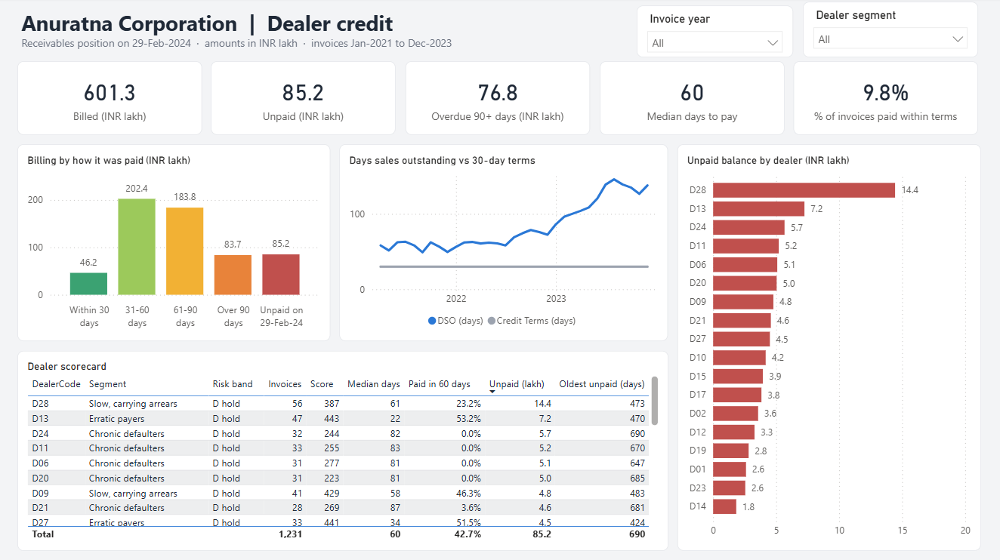
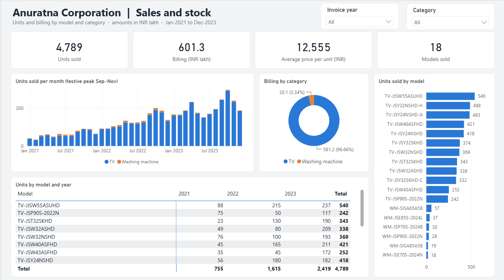

# Credit Cycle & Inventory Analytics for a Consumer Durables Distributor

**Case study: Anuratna Corporation, Jaipur (authorised Sansui distributor)**

**Awarded Best Project** in the Business Data Management capstone, IIT Madras BS in Data Science & Applications

This project analyses a real distribution business: why its dealers pay late, which dealers to trust with credit, what a credit policy is actually worth, and how to spend a limited stock budget. It is in two parts:

| Notebook | What it is |
|---|---|
| [Part 1: Descriptive and core analysis](anuratna_part1_descriptive_analysis.ipynb) | The capstone analysis: data cleaning, receivables ageing and DSO, payment behaviour by period, dealer segmentation, a first late-payment model, product demand and pricing, and the original recommendations |
| [Part 2: Revisiting the analysis with advanced methods (2026)](anuratna_part2_advanced_revisit.ipynb) | A return to the project with methods learned since: survival analysis, causal checks, leakage-free modelling, Monte Carlo policy simulation, forecast backtesting, stochastic optimisation and experiment design. It tests Part 1's conclusions and overturns several of them |
| [Power BI dashboard](dashboard/) | A two-page interactive dashboard on the same data: receivables, payment behaviour and dealer risk, plus sales and stock by model |

Both notebooks are self-contained, with explanations, outputs and conclusions. The notebooks and the dashboard all run on the same data.

---

## Contents

- [The business problem](#the-business-problem)
- [Part 1: what the capstone found](#part-1-what-the-capstone-found)
- [Part 2: what the revisit changed](#part-2-what-the-revisit-changed)
- [Recommendations](#recommendations)
- [Power BI dashboard](#power-bi-dashboard)
- [Methods](#methods)
- [Data](#data)
- [Tech stack](#tech-stack)
- [Author](#author)

---

## The business problem

Anuratna Corporation is a B2B distributor in Jaipur, Rajasthan. It buys Sansui televisions and washing machines and resells them to 29 electronics and mobile retailers across the city.

```
Sansui (brand)  ->  Anuratna Corporation (distributor)  ->  29 retail dealers  ->  consumers
   fixes prices        pays for stock up front,               buy on 30-day credit
                       earns a thin margin (~6-8%)
```

Dealers have 30 days to pay each invoice, but many take 60-90 days or longer and some don't pay at all. The firm pays Sansui up front, so every late payment means the distributor is financing the retailer's shop with its own borrowed money.

The proprietor raised three problems:

1. **Extended credit cycles:** slow payments and bad debts strain cash flow.
2. **Poor investment rotation:** money is stuck in slow-moving stock while popular models run short.
3. **Price wars:** competing brands undercut on price, but Sansui fixes the distributor's selling price.

## Part 1: what the capstone found

**Credit**
- The share of dealers who had cleared their dues fell from **82.8% to 55.2% to 37.9%** across three review periods (Apr'22-Oct'22, Nov'22-Mar'23, Apr'23-Oct'23).
- Only 12-17% of paying dealers settled within the 30-day terms.
- DSO rose from about 60 days in mid-2022 to about 135 by the end of 2023.
- 13 dealers held INR 71 lakh of the INR 85 lakh unpaid.
- A logistic regression flagged late invoices with ROC-AUC ~0.80.

**Stock**
- Nine of the twelve TV models grew every year.
- Demand peaks in the Sep-Nov festive season.
- Washing machines fell to under 2% of billing.

**Price**
- Sansui is already at or below competitor prices in every size, so price is not a lever for the distributor.

**Original recommendations:** a 3% discount for payment within 30 days, a 9% penalty after that, tighter follow-up of problem dealers, more stock investment in growing models, and exploring invoice financing.

## Part 2: what the revisit changed

**1. Part 1's payment metrics were misleading.**
Recent invoices had less time to be paid, and the "days to pay" box plots left out dealers who hadn't paid. Treating unpaid invoices as censored observations (Kaplan-Meier), the median time to payment rose from **59 to 74 to 95 days**, rather than staying flat at 56.5. On a fair, fixed 120-day window, **86%, 67% and 55%** of invoices were paid. The slowdown is real (log-rank p < 0.001), but smaller than the 83% to 38% drop suggested.

**2. Part 1's model was reading the future.**
Its dealer averages included payments made after each invoice, and it used a random train/test split. Re-scored honestly (point-in-time features, trained on 2021-22, tested on 2023), it drops from 0.80 to **0.74 ROC-AUC**. A new scorecard built only on information available on the invoice date reaches **0.83**, beating gradient boosting (0.77).

**3. The best warning sign is the age of a dealer's oldest unpaid bill.**
In a Cox model, every extra 30 days on that bill cuts the speed of payment by about a third (hazard ratio ~0.65). Once it is included, the latest period is no longer significantly worse: dealers already behind kept falling further behind.

**4. A Simpson's paradox on invoice size.**
Across dealers, bigger invoices seem to be paid faster, because big dealers pay well. Within the same dealer, bigger invoices are paid slower.

**5. The proposed 3% discount loses money; so does every discount tested.**
- Break-even for 30-day payment is about 2%.
- Retailers borrow at 14-26%, more than the distributor's ~11.5%, so few find early payment worth it, and those who'd pay early anyway pocket the discount.

A Monte Carlo simulation of the 2023 invoice book finds **overdue interest plus advance-only terms for five chronic defaulters** is the best policy, beating the status quo in every simulated scenario.

**6. "Growing" models mostly grew with the business.**
Testing each model's share of its category (Mann-Kendall), only one of the nine "growing" TVs (JST32SKHD) is genuinely gaining ground.

**7. The credit cycle costs more than the product mix.**
At ~92 days to get paid, financing stock and receivables eats about **60% of the TV gross margin**. A forecast-driven stochastic LP stock plan still beats repeating last year's mix on held-out demand, with far less unsold stock.

**8. The firm is too small for an A/B test to prove an effect.**
A power analysis on 24 dealers shows even a stepped rollout can't reliably detect a realistic +10-point improvement. The pilot is designed as a safety check with guardrail metrics instead.


## Recommendations

From Part 2, using tools the firm already has (Tally, WhatsApp, the salesman's visit schedule, a spreadsheet):

| # | Action | In practice |
|---|---|---|
| 1 | Weekly overdue list | Every Monday, print Tally's outstanding-receivables report with ageing, sorted by oldest bill |
| 2 | Collection calendar | WhatsApp reminder before the due date, phone call at day 35, salesman collects the cheque in person at day 50 |
| 3 | Dispatch rule | No new stock to a dealer whose oldest unpaid bill is over 60 days old without a part-payment or post-dated cheque |
| 4 | Advance-only for chronic defaulters | Five dealers buy against advance payment until old dues are cleared, with instalment plans backed by post-dated cheques |
| 5 | Interest on overdue bills | "18% p.a. on bills unpaid after 45 days" on every invoice; charged selectively, waived for dealers who keep to a payment plan |
| 6 | Monthly dealer review | Average days to pay, oldest unpaid bill and % paid within 60 days per dealer; A/B/C/D bands set credit limits each quarter |
| 7 | No early-payment discount | Reward reliable payers with higher limits and first allocation of festive-season stock instead |
| 8 | Quarterly purchase plan | Forecast TV demand, split by model share, cap at the budget; order washing machines only against confirmed orders |
| 9 | Five monthly numbers | DSO, % of invoices paid within 60 days, amount overdue beyond 90 days, unsold stock value, sales to A/B-band dealers |
| 10 | Stepped rollout | Start with a random half of dealers (stratified by segment), bring in the rest from month 4, and watch guardrail metrics |

Part 2 also explains why dealers would accept the new terms rather than switch distributors. Anuratna is the city's only Sansui source, the rules only affect dealers who don't pay, and compliant dealers are rewarded.

## Power BI dashboard

The analysis is also turned into a two-page Power BI dashboard, saved as a Power BI Project (`.pbip`) so the model and report are plain text and version-controlled.

### Receivables



- **KPI cards:** total billed, unpaid, overdue beyond 90 days, median days to pay, and the share of invoices paid within the 30-day terms
- **Billing by payment outcome:** within 30 / 31-60 / 61-90 / over 90 days / still unpaid
- **Days sales outstanding by month**, against the 30-day credit terms
- **Unpaid balance by dealer**
- **Dealer scorecard** combining the Part 2 segment, risk band and scorecard points with each dealer's payment record
- Slicers for invoice year and dealer segment

### Sales & stock



- **KPI cards:** units, billing, average price per unit and models sold
- **Monthly units by category**, showing the Sep-Nov festive peaks
- **Billing split** between TVs and washing machines
- **Units by model**, and a model × year matrix
- Slicers for year and category

### How it is built

| Layer | Details |
|---|---|
| Data model | Star schema: Invoices and InvoiceItems facts; Dealers, Products and Calendar dimensions; a dealer × month receivables table for DSO |
| Measures (DAX) | 16 measures in a dedicated KPI table, including DSO (open receivables ÷ trailing 90-day billing × 90), median days to pay, % paid within 30/60 days, overdue 90+ and oldest unpaid bill |
| Data loading | Power Query (M) loads the CSV tables through a single `DataFolder` parameter |
| Format | PBIP with TMDL semantic model and PBIR report definition |

The dashboard runs on the same representative dataset as the notebooks, which is not included in this repository.

<!--
## Results
Add figures reported by the firm here.
-->

## Methods

| Part 1 | Part 2 |
|---|---|
| Data cleaning (Tally exports, duplicate receipts) | Kaplan-Meier survival curves with censoring, log-rank test, dealer-level bootstrap |
| Receivables ageing, DSO | Cox proportional hazards with clustered errors; fixed-effects regression |
| Dealer heatmap, credit-cycle breakdown, box plots | Point-in-time features, out-of-time validation, leakage audit of Part 1's model |
| K-means segmentation (elbow method) | Logistic scorecard vs monotone gradient boosting, calibration, permutation importance |
| Logistic regression (late payment) | Monte Carlo credit-policy simulation with common random numbers |
| Year-on-year model trends, seasonal decomposition | Mann-Kendall trend tests on share of category |
| Competitor price index | Forecast backtesting (Holt-Winters, Theta, top-down) and a two-stage stochastic linear program with shadow prices |
| | Stratified randomisation and simulation-based power analysis for a stepped-rollout pilot |

## Data

The firm's data is confidential. The notebooks are shown on a representative dataset that reproduces its summary figures, so the dataset itself is not included in this repository.

The analysis uses six tables shaped like Tally exports: dealer master, sales invoices, payment receipts, invoice line items, product master, and competitor prices. It covers January 2021 to December 2023, with the receivables snapshot taken on 29 February 2024.

## Tech stack

Python · pandas · NumPy · SciPy (HiGHS LP solver) · statsmodels · scikit-learn · matplotlib · seaborn · Jupyter · Power BI (DAX, Power Query, TMDL/PBIR)

## Author

**Bhavya Sharma**, BS in Data Science & Applications, IIT Madras

Thanks to the proprietor of Anuratna Corporation for permission to use the firm's data for academic purposes.
